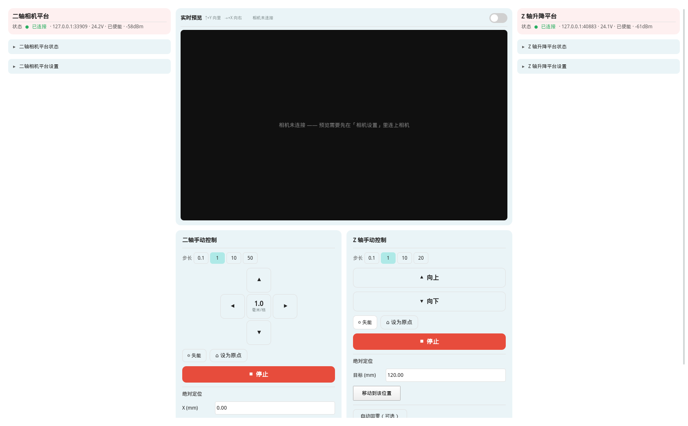
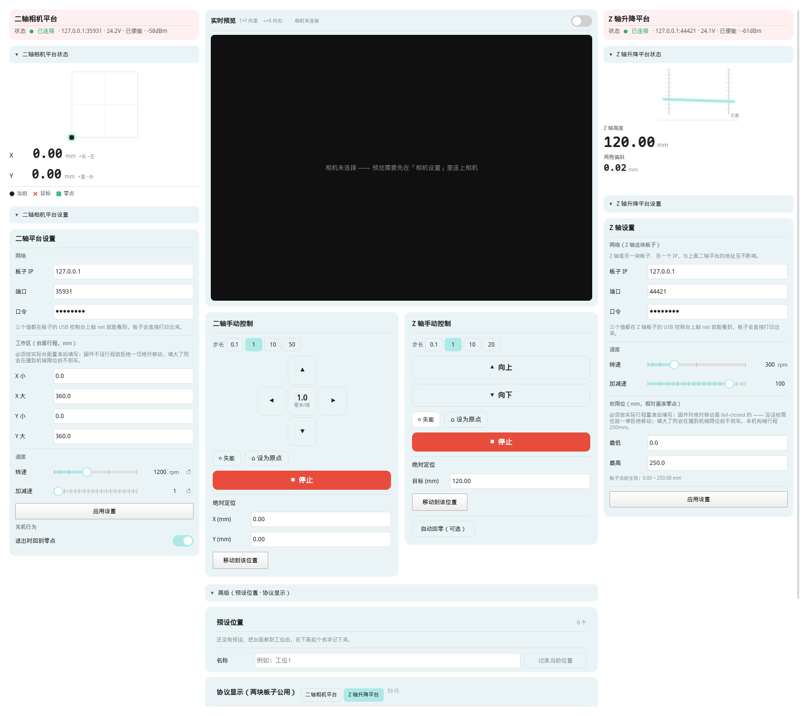

# 18 Z 轴升降平台控制（第二个平台卡片）

> 对应固件：`研究生毕业设计/esp/Zstage`（ESP32 + 两台 PD42S1，双丝杠升降）。
> 对应代码：`backend/Src/zstage_bridge.py` + `pages/StagePage.qml` 的「Z 轴平台」区 +
> `pages/minipages/ZStage*.qml`。测试：`tests/test_zstage_bridge.py`、`tests/test_zstage_page.py`。

## 1 目标与边界

**目标**：在已有的「平台控制」页里，把毕业设计新增的 **Z 轴升降平台**也管起来 ——
点动上下、绝对高度定位、立基准、软限位、急停、状态遥测，外加一个**协议显示框**
（能看到发出去/收回来的协议原文，包括驱动器层的自定义串口报文）。

**边界**：
- Z 轴是**另一块板子**（同一份 PCB 设计，另一套固件），有自己的 IP / 端口 / 口令。
  所以它是一个**独立的卡片**，不是给二轴平台"加一轴"。
- 相机、算法、采集链路**完全不动**。Z 卡片只依赖网络，板子不在线时页面照常打开。
- 不做"退出回零点"、不做预设位置（Z 轴的预设意义不大：高度是靠基准算出来的，
  而基准每次上电都要重立 —— 见 §7.4）。

## 2 为什么必须是"另一个卡片"

板子的 WiFi 通道是**单客户端**的 TCP 服务端（`net_link_tcp`）：已经有一个客户端连着时，
第二个连接会被回 `#ERR busy` 并断开。两台板子各有自己的服务端，所以：

```
上位机 ──┬── StageBridge    → 二轴平台板 (192.168.x.a:3333)
         └── ZStageBridge    → Z 轴平台板 (192.168.x.b:3333)
```

两个桥**互不知道对方存在**，各自有连接状态、各自的命令队列、各自的轮询定时器。
这正是我们要的：一块板子掉线不影响另一块。

> ⚠ 如果哪天改成"同一块板子跑两套轴"，那就**不能**各连一条 —— 单客户端会互相踢。
> 届时必须改成"共用一个连接、按前缀分流命令"。这一层现在没有做，因为它会把
> 两个桥的队列/在途/错误状态耦合在一起，而收益为零（现在就是两块板）。

**两台板子用的是同一个端口 3333 —— 这不是冲突**：

- 3333 是**固件里的编译期常量**（`Zstage/components/net_link/net_link_tcp.c` 的
  `NET_LINK_TCP_PORT`，二轴板那份 `Steppermotor/components/net_link/net_link_tcp.c`
  同样是 3333）。一台机器上两个**客户端**去连**两个不同 IP** 的同一个端口号，
  在 TCP 里完全正常（四元组里本地端口是临时端口，不一样）。
- 真正会撞的是**两个板子被分到同一个 IP**（DHCP 池小、或者手工设了同一个静态地址）。
  判断方法：两块板子各自在 USB 控制台敲 `net`，它会直接把该填的三个值打出来：

  ```
  net: 命令通道监听中，端口 3333，口令 <token>
       WiFi "xxx" 已连接，信号 -58 dBm
       上位机填写 ->  地址 192.168.1.42   端口 3333   口令 <token>
  ```

  两边打印的**地址必须不同**；口令相同没关系（各板各存各的）。
- 想换端口就得改那个宏重新编译（没有 NVS 配置项）。

## 3 架构

```
ZStageBridge (QObject, 注册为 QML 的 ZStageBridge)
 ├─ QTcpSocket        异步、走 Qt 事件循环（不要线程 + 阻塞读）
 ├─ 命令队列          单在途；stop all 走 front=True 插队
 ├─ 轮询 QTimer       空闲 1Hz / 运动中 5Hz，发 json
 ├─ 遥测镜像          json 一行 → 全部属性 + notify
 ├─ 协议显示框        protoLines：每一条 → / ← 原文 + @T/@R 驱动器帧
 └─ QSettings         zstage/host|port|token|rpm|acc|step|lim_lo|lim_hi
```

页面侧（`StagePage.qml`）：两台板子各占一列 —— Z 列 = 设备卡片（页顶）→ 遥测读数 →
点动/定位 → 折叠的「Z 轴设置」→ 折叠的「协议显示框」；与 X/Y 列共用 `FoldHeader`
折叠范式与全部通用组件。版面与约束见 §3.1。

### 3.1 版面：三列（左右窄列 + 中间预览）——v4.2

```
┌───────────────┬──────────────────────────────────┬───────────────┐
│ 二轴相机平台卡  │                                  │ Z 轴升降平台卡 │
│ 一行状态       │      实时预览（按 2448×2048 等比，  │ 一行状态       │
│ ▼ 平台状态(折) │       画面在卡内居中、允许黑边）    │ ▼ 平台状态(折) │
│  缩略图 + X/Y  │                                  │  双丝杠示意     │
│ ▼ 平台设置(折) │                                  │  Z 高度/偏斜    │
│  网络/工作区/速度│ ┌────────────┐ ┌────────────┐    │ ▼ 平台设置(折) │
│  [应用设置]    │ │二轴手动控制 │ │Z 轴手动控制 │    │  网络/速度/限位 │
│               │ │步长/十字键  │ │步长/上下键  │    │  [应用设置]    │
│               │ │失能/设原点  │ │失能/设原点  │    │               │
│               │ │■ 停止      │ │■ 停止      │    │               │
│               │ │绝对定位     │ │绝对定位     │    │               │
│               │ └────────────┘ └────────────┘    │               │
│               │        ▼ 高级（预设位置·协议显示）  │               │
└───────────────┴──────────────────────────────────┴───────────────┘
```



五个折叠节全展开（左右列的「状态」「设置」+ 中列的「高级」）：



**三列宽度（v4.2）** —— 用户第四张手绘稿定了三列；落地时唯一的坑就是"三列各占多宽"：

```qml
_sideMax = 420, _midMin = 380
_effSide = max(160, min(_sideMax, 页宽 × 0.24, max(160, (页宽 − 2×间距 − _midMin) / 2)))
_midColW = max(340, 页宽 − 2×_effSide − 2×间距)
_jogSideBySide = (_midColW >= 700)      // 中列窄了就上下叠
```

- **宽屏看比例**：手绘稿是 160:350:160 ≈ **24%:52%:24%**。全屏（页宽 1680）→ 侧列 403、
  中列 850；1280 → 307 / 642。
- **窄屏先保中列**：`_midMin = 380`（够放一张控制卡）；730（最小窗口）→ 侧列 163、中列 380。
  `_sideMin = 160` 是折叠头的底线。
- ⚠ v4.1 曾用"21% + 上限 340"，全屏时侧列只有 **340**、中列 **976** —— 两个具体毛病：
  ① 连接卡副标题被裁掉一半（`… · -58d`）；② 预览卡被拉成 976×530 的大黑框
  （画面只占中间 559px，两侧各 ~200px 黑边）。**修法是改配比，不是改预览**。

四条设计约束（改版面时别破坏）：

1. **整页一条滚动链**（手绘稿右侧那个「滑块滚动」）：`pageScroll` 是唯一的滚动容器，
   三列都在它里面，**谁都不单独滚**。
2. **五个折叠节默认全部收起**（左右列各两个 + 中列「高级」）：首屏只留"连接状态 + 预览 +
   两张控制卡"。齿轮点一下 = **展开本列的设置折叠节 + 把整页滚过去**（`_openFold`；
   ⚠ 必须等一帧再滚，否则 contentHeight 还是旧值、滚不动 —— AGENTS 第 24 条）。
3. **两张控制卡用 `GridLayout` + 动态 `columns`**：宽了并排、窄了自动上下叠；
   单个封顶 520 并居中（超宽屏不封顶会被拉成横幅，里面空荡荡）。
4. **控件不一律填满**：动作按钮 = 内容宽 + 留白 + 行尾弹簧靠左，上下键 260 居中，
   输入框 132/176，表单跟着窄列走。用户原话："所有的组件的大小都是填满的，这样很不好看。"

### 3.2 界面只留操作：删掉的东西去哪了（2026-09-28 精简）

用户反馈"UI 内容上有点不是很美观"，方向是**"只把最常用的操作留在上位机上，
细节或者测试留在后端控制台"**。那一页当时贴着 32 段 / 1050 字的 10px 说明文字，
病根就在这儿。改动：

- 顶上那排**红绿圆点状态条**（X/Y 5 个、Z 6 个）→ 一行 `components/StatusLine.qml`：
  正常项是灰字、**只有异常项**变红加粗（"沉默即正常"）。电压/信号强度从这里删掉
  （它们已经在连接卡片副标题上）。
- **读数卡去卡片化**（`PositionReadout.flat` / `ZStageTelemetryPanel.flat`）：
  大号读数当"列头"，一屏里的同色圆角块从 9 张降到 3~4 张。
- 删掉 20+ 段静态说明；按钮从长文案（「⌂  把当前位置设为原点」）缩成「⌂ 设为原点」+
  ToolTip（悬停才出，平时不占视线）。
- 「上电自动回零」开关删除（⚠ **2026-09-29 又加回来了**，用户点名要求，见 §3.2.1）；
  X/Y 读数卡里"工作区 360×360 / 0,0→360,360 / ↑+Y 向里"
  三行删除（前两者在「平台设置」和缩略图上都有，方向说明在预览表头已有一份）。
- **二轴诊断面板整块删除**（用户 2026-09-28 点名）：板子状态摘要 / 指令日志 / 立即刷新
  都去掉了，改用下面那个公用协议框与板子 USB 控制台。
- **协议显示框改成两块板子公用**（`Src/proto_hub.py`）：两路合并、带 `[XY]` / `[Z]` 前缀，
  暂停/清空两路一起，自定义命令带目标选择器。详见 §6。

**删掉的能力都还在，只是换了入口** —— 这个页面的协议显示框里那个自定义命令输入框，
语法与板子 USB 控制台**完全一致**，等于把控制台搬进了界面：

| 原来的界面控件 | 现在怎么用 |
|---|---|
| 转速 / 加减速滑块 | `zset rpm 300` / `zset acc 100`（滑块仍保留，只是不再配说明文字） |
| 关节读数 / 方向符号 / 固件软限位 | `zsign` / `json` |
| 诊断日志（X/Y 那块） | X/Y 板子的 USB 控制台（协议框目前只连 Z 板） |
| 自动回零的代价、跳齿与转速、对数刻度…… | `docs/17`、`docs/18`、`components/*.qml` 的注释 |

⚠ **「上电自动回零」开关 2026-09-29 又回到了界面上**（用户点名要求，和限位电流一起调）。
上面那张表里那一行只适用于 2026-09-28~29 那一天；现在它有自己的 `SwitchRow`，
而且**不许带方向**（`zautohome on`，板子里存的方向归「上电自动回零」，
手动按钮的方向走 `setHomeDir` 只存本机）—— 见 §7.7。

### 3.2.1 自动回零的参数与方向（2026-09-29 新增）

用户提的两个问题直接决定了这一节：

1. **"自动回零的限位电流好像没法设置"** —— 对，固件早就有
   `zset home <rpm> <mA> <timeout_ms>`（存 NVS），只是桥里没接、界面上没入口。
   现在「Z 轴升降平台设置」折叠节里有「自动回零参数（存板子）」一段：
   限位电流 / 回零转速 / 回零超时 + 「写入回零参数」按钮。
   - 范围与固件 `cmd_zset` 的检查**逐条对齐**（rpm 1~6000、mA 1~3000、tmo 1000~120000ms），
     并且**只从桥里读**（`uiHomeRpmMin/Max`、`uiHomeMaMin/Max`、`uiHomeTmoMin/Max`）——
     界面比固件宽 = 用户能填一个必然被拒的值。
   - **甜点区警告**（<60mA 假成功 / >300mA 不触发）在**填的当下**就显示，
     不等到下发之后 —— 这两条线与固件 `zset home` 打的那两行同义。
   - 显示分两行：「我填的」（输入框）与「**板子当前生效**」（json `hma/hrpm/htmo`）。
     为此固件 `json` 新增了这三个字段（没它们就只能去解析 `zcfg` 的中文文本）。
   - 三个值**一起发**：固件要求 `<rpm> <mA>` 都在场（`argc > 3`），
     只改一个字段也得把另两个带上。
2. **"使能/失能没有颜色指示"** —— 现在按钮的颜色**就是状态**：

| 状态 | 语气 | 样子 | 理由 |
|---|---|---|---|
| 未使能 | `success` | 淡绿底 + 绿描边/绿字 | 电机不出力，可以手推平台去靠块 —— 安全的一侧 |
| 已使能 | `dangerSoft` | 淡红底 + 红描边/红字 | 闭环抱死 + 带电 —— 危险的一侧 |
| 未连接 | 中性白 | 白底 + 灰字 | 状态**未知**时画成绿色等于撒谎（ThemedButton 里 success 禁用即回中性） |

   刻意**不**用实心红 `danger`：同一张卡里已经有实心红的「停止」，两个实心红会让人
   分不清哪个是急停。按钮文字仍然是**动作**（使能/失能），状态由颜色说 ——
   两张卡（X/Y 与 Z）用同一套语言，`Colors.successSoft` 是为此新增的令牌。


两条硬约束（都有测试钉着）：**首屏够得着**（方向键/急停/设原点必须在 1080p 首屏内，
`test_stage_page.py` 12a2 —— 当时「停止」的底边差 9px 就是靠它发现的）、
**不许长回来**（两个页面测试各有一条"禁止短语"守卫）。

### 3.3 配套的两处**文案改动**（都是被这个版面逼出来的）：

- 卡片标题**永远是平台名**，地址下沉到副标题第一段。原来连上以后标题会变成
  `host:port` —— 两台并排、又都用 3333，标题全变成地址就分不清谁是谁了。
- 「未配置地址」提示条从"纯文字"改成**可点**（点一下展开并滚到设置面板）。

## 4 协议：与二轴**同一套**行协议

Z 固件复用了二轴平台的 `net_link` 组件，协议一字不差：

```
连接后第一行 = 口令                → 板子回 #OK auth
之后每行 = 一条命令                → 回：命令输出若干行 + 末行 #OK / #ERR <code>
空闲时用 json 轮询                 → 一行 JSON 拿全状态
```

**连接序列必须是只读的**（照抄本项目的铁律，见 `AGENTS.md` 第 12 条）：

| 阶段 | 发什么 | 为什么 |
|---|---|---|
| 连上后第一行 | 口令 | 协议要求 |
| 认证通过后 | `json` | 只读遥测 |
| 认证通过后 | `zsign`（**不带参数**） | 只读 —— 把方向符号读回来显示 |

⚠ **绝不**在连接期发 `zzero` / `zhome` / `zlim` / `zset`：它们都会改状态，
其中 `zhome` 直接让电机去找零点（驱动器收到 0x91 就动）。二轴平台当年就是
"点一下连接，台面自己回零了"（`docs/17` §11.1），这里用同样的规矩防住。
`tests/test_zstage_bridge.py` 第 4 组盯着这件事：连接期出现任何运动命令即失败。

### 4.1 单位：**没有换算边界**

二轴平台的固件用"电机度"，所以 `stage_bridge.py` 里有一层 `1mm = 11.25°` 的换算，
并且明确写着"这个文件是唯一的换算边界"。**Z 轴没有这一层**：

- Z 固件对外就是 **mm**（`zmove 100.000`、软限位 mm、`json` 的 `z`/`skew`/`zmin`/`zmax` 全是 mm）；
- 所以 `zstage_bridge.py` **一个换算常数都没有**，界面拿到什么就显示什么。

⚠ 别照着 `stage_bridge.py` 抄一个"看起来对称"的换算出来 —— 那是凭空的第二事实源。

### 4.1.1 点动的两条硬限制（界面必须遵守）

- **单次 ≤20mm**：固件 `zup`/`zdown` 里 `if (mm > 20.0f)` 直接拒绝。
  所以 `STEP_CHOICES` 最大只到 20 —— 给到 50 的话那一档**永远是被拒绝**的
  （界面上就是"点了没反应"）。要走更远请用「绝对定位」或连点几次。
- **点动不需要基准**：固件故意允许无基准相对点动（并打一行 ⚠ 说明软限位不生效），
  因为"把平台挪到参考位置"就是立基准的前置步骤。桥的 `canJog` 和它一致
  （只要求"连着 + 没在动"），而 `canMove`（绝对定位）仍然要求"基准 + 软限位"。
  ⚠ 界面要是把点动也灰掉，首次立基准就只剩"用手推平台"这一条路了。

### 4.2 只走非阻塞命令

| 用途 | 用 | **不要**用 | 原因 |
|---|---|---|---|
| 点动 | `zup` / `zdown` | `zrel` | `zrel` 会等到位（几秒），急停会被堵在通道里 |
| 绝对定位 | `zmove` | `zabs` | 同上 |
| 回零 | `zhome down nowait` | `zhome down` | 阻塞版要等回零结束（几十秒） |

到位判定一律靠轮询 `json` 的 `moving` / `last`（固件在 `json` 里顺手做了到位判定）。

## 5 固件侧的安全设计（界面必须配合的部分）

| 闸 | 表现 | 界面怎么配合 |
|---|---|---|
| **基准闸** | 没立过基准 → 绝对定位**直接被拒**，一条运动指令都不发 | 未连接/无基准/无限位时**按钮禁用 + 旁边写出原因**（`datumHint`） |
| **软限位闸** | 没设软限位 → 同样拒绝（fail-closed） | 折叠面板里有 `zlim` 设置，未设时提示去设 |
| **超程看门狗** | 运动中越过限位外沿 → 刹车 + **锁存故障** | `fault`/`faultText` 显示；提示先 `stop all` 清故障 |
| **偏斜看门狗** | 运动中两侧高差超阈值 → 刹车；**停下复测**：仍超才锁存（`fault=skew`），复测正常则只中断这一趟、**不锁存**（那是两次读数相隔 ~20–40ms 造成的假分量，并且急停本身也会引入真实偏斜） | 显示方向符号 `signText`；`fault=skew` 时提示先核对符号；`last=aborted` 且 `fault=none` 时说明是采样时差假报警，可直接继续（原因会打印在协议框里）。余量可用 `zset skewrun <mm>\|auto\|off` 调 |
| **关节常识闸** | 任一关节读数超出 ±300mm 当量 → 刹车（**不需要基准**） | 同上，`fault=runaway` |
| **运动互斥锁** | 并发运动互相拒绝 | 运动中禁用新的点动（队列深度 1）；`stop all` 永远可点 |

**急停**：`stop all` 在固件侧是"先刹车 → 无条件给两轴发 0x93 → 收在途状态 → 打印"，
**能打断正在阻塞等待的命令**，所以它是真急停。界面上它的 `enabled` **只跟 `connected` 走**
（不跟 `moving`/`canMove` 走），而且走 `front=True` 插到队首 —— 这两条都有测试钉住
（`tests/test_zstage_bridge.py` 第 15 组、`test_zstage_page.py`）。

## 6 公用协议显示框（用户特别要求的功能）

**2026-09-28 起它是两块板子公用的**。用户原话："板子的协议显示修改为公用的，因为我只要
将 usb 线接到不同的板子上，这个就会有对应的指令。" —— 两块板子跑的是同一套行协议
（§4），所以界面上只画一个框：

```
ProtoHub({"xy": StageBridge, "z": ZStageBridge})     ← 只有一个框，两路合并
   ├─ 订阅每块桥的 ProtoLog.lineAdded（逐行、带 tag）
   ├─ 合并成 [XY] → json / [Z] ← #OK / [Z]    @TX left C5 …
   └─ 节流后 changed → QML 的 protoList
```

设计取舍（都在 `Src/proto_hub.py` 的注释里）：

- **不做"选一块看一块"，而是两路合并 + 前缀**。两块板子可以同时连着，出问题时最想看的
  恰恰是"谁先答的、谁没答"——分成两个框就没法对齐时间线了。
  界面上那个来源选择器只决定**自定义命令发给谁**、以及帧镜像开关跟着谁走。
- **封顶与节流是两层**：单路 `PROTO_CAP = 400`（`ProtoLog`），合并后 `HUB_CAP = 800`。
  `lineAdded` 逐行发（开销只有一次 append），`changed` 才节流（80ms）。
- **暂停/清空两路一起**：用户按暂停是想"冻住这一刻"，只冻一路没有意义。
- **能力从桥上报**（`supportsTrace`）：帧镜像（`trace`）只有 **Z 轴那块板子的固件**有，
  二轴板没有 —— 所以切到二轴时开关是灰的，并在旁边写明原因（禁用必须说原因）。
  能力写在桥上、不写在界面里：以后二轴固件补齐了 `trace`，改一个 `False` → `True` 即可。

两层内容，同一个框里看：

| 层 | 行样式 | 来源 | 开关 |
|---|---|---|---|
| ① 命令层 | `→ zmove 100.000 300 100` / `← {"z":…}` / `← #OK` | 桥自己收发的每一行（**含 json 轮询**） | 常开 |
| ② 驱动器层 | `   @TX left C5 01 F3 00 … 5C` | 固件的 `trace on` 把 UART 报文镜像回来 | 界面上的「驱动器帧镜像」开关 |

实现要点：

- **`@` 开头的行走独立分支**（两块桥的 `_handle_line` 第一个 if）：它们是
  **异步插进**命令应答里的（产生于总线事务内部），绝不能被算成"这条命令的输出"
  —— 否则请求-应答会对不上号。测试第 17 组断言 `←` 开头的行里**没有**帧行。
- 驱动器帧行的**左右区分靠 UART 端口**，不是从机地址：两台驱动器的地址**都是 0x01**。
  固件在 `trace` 回调里把 `uart_port` 一起带出来（`motor_bus_set_trace`）。
- **必须有上限**：`PROTO_CAP = 400` 行。开着帧镜像时每帧两行，运动中每秒上百行，
  不封顶就是内存与重绘的无底洞。
- **发射要节流**：`PROTO_EMIT_MS = 80`。一行一次 `protoChanged` 的话，每秒上百次
  列表重建会把 GUI 线程打满；而 GUI 一卡就不读 socket → 固件的 `send()` 阻塞到 2s
  超时 → **反过来把总线事务拖住**。也就是说"显示得太勤"会伤害固件。
- **暂停/清空**：`setProtoPaused(bool)` / `clearProto()`。暂停只停"追加"，不断链路。
- **自定义命令框**：`ProtoHub.sendCommand(来源, text)` 把用户敲的一行原样发给**选中的那块**
  板子（语法与 USB 控制台完全一致）。**不做白名单** —— 但运动命令仍然受固件那几道闸约束，
  所以乱敲不会绕过安全保护。返回 False 时界面必须说清楚原因（"点了没反应"是本项目最忌的形态）。

固件侧的接口（`Zstage` 仓库）：
- `motor_bus_set_trace(fn)`：注册回调，`fn(dir, uart_port, buf, len)`；传 `NULL` 关掉。
  **默认 NULL = 零开销**，不改变任何通信行为。
- `trace on|off` 命令：注册/注销这个回调。
- ⚠ 回调是在**总线锁释放之后**调用的：motor_bus 在锁内只把收发字节抄进一个
  8×48B 的环形缓冲（纯内存操作），事务结束、锁放掉之后再逐格回调。
  **为什么非要这么绕**：如果在锁里打印，`out()` 的 TCP sink 有 **2 秒**发送超时，
  对端一旦不读（界面卡住），一帧就能把总线锁住 2 秒 —— 而六道看门狗全都靠总线读位置。
- ⚠⚠ **全局锁序**（2026-09-27 评审抓出一处 ABBA 之后定下来的）：
  `输出锁(console_io) → pair 锁 → 总线锁`。唯一的已知例外是 `home_close()`
  （持输出锁 → `drvlim_program()` → 取 pair 锁）。所以**持 pair 锁时绝不许打印** ——
  帧镜像的 drain 因此**不在 post/reap 里**做，而是由 `move_pair_rel` 在
  `motor_bus_pair_end()` 之后调 `motor_bus_trace_flush()`。
  （这条也是为什么 trace 打印**不能**夹在 post(A)/post(B) 之间：那会把 2.5ms 的
   两轴同步起步变成"一次打印"的时长，TCP 卡住时相当于几十毫米的起步偏斜。）
- ⚠ `trace` 是**排障窗口**功能，不是常开：文档里三处都写明了"看完就关"。

## 7 ZStageBridge 设计

### 7.1 属性（全部带 notify，QML 直接读）

分四组：连接（`connected`/`connecting`/`lastError`）、设置（`host`/`port`/`token`/`rpm`/`acc`/
`step`/`limitLo`/`limitHi`/`uiMaxRpm`/`uiMaxAcc`/`uiMinAcc`）、遥测（`z`/`skew`/`jointA`/`jointB`/
`voltage`/`enabled`/`datum`/`limitsSet`/`firmwareLo`/`firmwareHi`/`moving`/`lastMove`/`homing`/
`autohome`/`target`/`umPerRev`/`rssi`/`boardIp`/`signText`/`fault`/`faultText`）、
界面派生（`canMove`/`datumHint`/`diagText`/`protoLines`/`logLines`/`protoPaused`/`traceOn`）。

⚠ **派生量必须是带 notify 的 Property，不能是 `@Slot` 函数**：QML 绑定里调函数没有
依赖追踪，值会冻结在创建那一刻（本项目第 6 条坑，二轴那边的诊断面板就栽过）。

### 7.2 量程的单一事实源

| 值 | 出处 | 为什么 |
|---|---|---|
| `uiMaxRpm = 1200` | 固件 `BOARD_Z_MAX_RPM` | 固件超了会**按 1200 执行**并加一行说明 —— 界面给 3000 就是"拖了看到的和实际下发的不一样" |
| `uiMaxAcc = 200` | 固件 `zset acc` 的上限 | 超过直接参数不合法 |
| `uiMinAcc = 1` | 手册：**"数值越大加减速越大，0 表示直接启动"** | 0 = 无斜坡直接启动，必须排除；1 才是真正的最小值 |

界面**不许硬编码**这几个数（本项目第 19 条坑：同一个数字出现在两处迟早漂移，
而漂移是静默的）。回归守卫断言 `SliderRow.to == ZStageBridge.uiMaxRpm`。

### 7.3 目标先夹取再发

`moveTo()` 按**固件实际在用的**窗口夹取（`json` 的 `zmin`/`zmax`，不是本地设置 ——
别人可能用 USB 控制台改过），夹取后记一行日志再下发。固件那道闸只当兜底：
界面先把目标夹住，用户才不会看到"点了没反应"。

### 7.4 基准是 RAM，每次上电都要重立

驱动器用**单圈编码器**，掉 24V 就丢多圈位置；固件的 `datum` 标志也在 RAM 里。
所以：断线（可能板子重启过）时桥会把 `datum`/`limitsSet` **一律作废**，
重连后第一次 `json` 再刷回真实值。宁可保守 —— 显示"已立基准"而实际没有，
会让用户以为绝对定位是安全的。

> ⚠ 这一段是**测试抓出来的**：早先清标志写在 `if was:`（原来连着才算）里面，
> 而 `disconnectDevice()` 会先把 `_authenticated` 置 False，于是"主动断开"这条路径
> **根本清不掉**。测试第 21 组盯着它。

#### 7.4.1 怎么把平台弄到"基准位置"？

`zzero` 的前提是平台**已经物理停在**靠块/机械死点上。三条路：

| 做法 | 说明 | 代价 / 风险 |
|---|---|---|
| **「失能（可手推平台）」→ 用手推到底 → 「设为原点」**（推荐主线） | 最直接、力小可控。本机丝杠**自锁**，失能后平台停在原地，推着走正合适 | 只保证**静态**：失能后外力/振动仍能推动平台 —— 别在下面放手 |
| 「自动回零（可选）」→ `zhome down nowait` | 驱动器自己朝下走，靠**相电流阈值**判"顶住了"，然后把当前位置设成原点 | 两根丝杠**必须同时**顶到各自死点，否则会把平台拧歪；限位电流不在甜点区会假成功/假失败 |
| 点「向下」一步步走到贴住死点 | 不用失能 | 会顶到堵转、驱动器可能报过载；只适合最后几毫米 |

> **✅ 2026-09-27 现场确认：这根丝杠是自锁的** —— 断电/失能后平台**不会下滑**，
> 用手推才动。所以界面上**有**「失能（可手推平台）」按钮（在「Z 轴手动控制」里，
> 挨着「设为原点」）。
>
> ⚠ 这里**推翻过一个决定**：早先故意不放这个按钮，理由写的是"丝杠不自锁、失能会掉下来"
> —— 那个前提是按**导程角**算的（8mm 导程 ⇒ λ≈18° > 摩擦角≈6°），**算错了**：
> 摩擦系数按 μ≈0.1 取，而梯形丝杠配塑料/铜螺母常在 0.15~0.25（摩擦角 8.5°~14°），
> 再加电机定位力矩与联轴器刚度，静载下就是停得住。
> **教训：机械常数推不出来就得实测；实测一旦推翻前提，依赖它的决定要一起复查**
> —— 这次连带改了：失能警告文案、这个按钮、以及下面 Q5b 的噪声机理。
>
> ⚠ 两者分工写清楚：
> · **急停 `stop all`** = 刹车 + **保持使能** → 只想"停住"用它（闭环仍抱着平台）；
> · **失能 `dis all`** = 电机完全不出力 → 想**用手推平台**才用它。

### 7.5 错误的生命周期（三种，别混）

| kind | 例子 | 什么时候清 |
|---|---|---|
| `transient` | 超时、socket 错误、连接断开 | **链路恢复就清**（命令成功时 `_maybe_clear_error`） |
| `gate` | 缺基准 / 未设软限位 | **条件满足就清**（否则会出现"状态条全绿、下面还挂着红字"的自相矛盾） |
| `action` | 固件 `#ERR` 拒绝、参数不合法 | 不自动清 —— 但要**同类操作成功时清**（`_clear_error_if(src)`）：用户把软限位改对了再点一次，红字就该消失，否则界面会一直挂着一条与现状矛盾的提示 |

### 7.6 乐观置 `moving`

点动/定位/回零发出后**立刻**置 `moving = True`：固件的 `moving` 要等下一次 `json`
才回来，而空闲轮询是 1Hz —— 不乐观置位的话，点一下方向键要过一秒界面才"知道"在动，
而且轮询频率还停在 1Hz（"运动中 5Hz"那条永远不会触发，位置读数看起来一顿一顿）。
代价是命令被拒时这一位最多多挂一个轮询周期。二轴那边也是这么做的。

`setAutohome()` 同样乐观改 `_autohome`：界面的开关已经拨过去了，不乐观置位的话它会
先弹回旧值再弹过来（一闪一闪像坏了）；板子真拒绝时下一次 `json` 会纠正回来
（面板里有 `Connections` 回同步）。

### 7.7 自动回零：参数、方向、以及"停止"为什么曾经按不动（2026-09-29）

**参数**（`setHomeParams(rpm, ma, tmo)` → `zset home <rpm> <mA> <tmo>`）：
范围与固件逐条对齐并在本地先拦（超范围直接给红字，**一条都不发**）；三个值一起发；
与板子当前值相同时本地判定不发（省一次在途）；甜点区之外只**警告不拒绝**
（现场换电机/换丝杠时确实需要离开甜点区，但后果必须写出来）。

**方向**（`setHomeDir("up"|"down")` → `zhome <dir> nowait`）：
只存本机 QSettings，**不写板子** —— 板子里的 `home_dir` 属于「上电自动回零」，
两条路径分开（用户 2026-09-29 明确选的）。所以 `setAutohome()` 也**不带方向**：
带 `down` 就等于顺手把板子里存的方向改掉。

**"停止"在回零中按不动/延迟十几秒**（用户报的现象）：根因在**固件**，不是这个桥 ——
固件 `cmd_stop` 原来把 0x93（唯一能让驱动器退出回零的命令）排在"每轴 3 次 × 500ms"
的刹车重试**之后**，最坏 3 秒才发出去，再叠上自己的重试 → 最坏 ~6s；
驱动器若整段不回，就一路顶到它自己的 12s 超时。修法见固件
`docs/使用说明.md` §6：0x93 提到最前、单次超时压短、未送达由 100ms 滴答重发
（预算 1.5s）、每次尝试的耗时打进 `stop` 的输出。

桥这边配合的一条：**`stop` 的超时必须比固件最坏耗时更长**（`SLOW_CMD_TIMEOUT_MS["stop"] = 8000`）。
原来吃默认 3000ms，比固件最坏还短 —— 迟到的 `#OK` 会与**下一条**命令配对错位
（本文件顶部把这种错位列为事故），界面还会挂一条假的"急停超时"。
⚠ 另注意板子的 TCP 任务是**串行执行**的，所以"桥抢先写进去"救不了急停：
真正决定快慢的是板子当前正在执行的那条命令 + 固件自己的打断路径。

**另外两条 2026-09-29 由用户现场报来的**（都在固件侧修，界面只是照实显示）：

| 现象 | 根因 | 修法 |
|---|---|---|
| 点「自动回零」后**左侧先往下、右侧才往下** | 固件 `home_arm()` 逐轴"配 0x91 → 读状态（最多 3 次 × 睡 60ms）→ 发 0x92"，两轴起步差被拉到 200~400ms（400rpm/8mm 下第二轴已走近 1mm，平台被拧） | 与运动路径同一套两段式下发：0x91 成对 post/reap、0x92 成对 post/reap、"确认有没有自己起来"改成**两轴一起等**（≤60ms）。固件 `docs/使用说明.md` Q9b |
| 点「使能」偶发红字"回了 ok 但读回来仍是『未使能』" | 驱动器停在运动/回零状态里时会**忽略**改使能（也可能真的是 EN 脚问题）—— 原来的文案只笼统列"两种原因"，用户不知道该做什么 | 固件 `en` 先判阻塞原因（回零挂着/运动在途/驱动器自报运行状态）并**提前拒绝**（一条 0x2F 都不发），把可照抄的命令写在输出里；只有全都不是时才指向 EN 脚/驱动器异常。见 Q9 |

⚠ 上表第二条与第一条是**连着的**：回零刚跑完（或刚被打断）时驱动器还在回零状态机里，
这时点「使能」就会撞上它。界面侧别去"自动补一条 `stop all`" —— `stop all` 会顺带
清掉故障锁存，那是安全语义，不能由一次「使能」点击顺手做掉。

### 7.8 回零之后驱动器停在「模式 7」，以及「超时够不够」（2026-09-29 第二次现场）

用户第二次实测回零后报了三件事，其中**两件是固件的真 bug**（都在固件侧修，界面配合）：

| 现象 | 根因 | 修法 |
|---|---|---|
| 回零之后点动/定位行为诡异、连「使能」都改不动（红字"回了 ok 但读回来仍是『未使能』"） | 写 0x91/0x92 之后**驱动器自己**把工作模式切成 **7 = `PD42S1_MODE_HOMING`（回零模式）**，而且**不会自己切回来**；固件里只有开机那一次会掰正它 → 回零之后的整个会话都跑在模式 7 里（`0xF2/0xF3` 不再是通信位置语义） | 固件 `home_close()` 收尾调 `restore_comm_mode()`：切回 0 + **读回校验**，报告里写明"驱动器工作模式：回到 0（通信位置）✓"，没切回来就提示 `mode <轴> 0` |
| 回零"没跑完就停了"（驱动器自己停下、面板显示「异常」） | 驱动器侧超时（0x95）从**触发那一刻**起算，而用户的超时是 **4000ms** —— 满行程 250mm 在 300rpm/8mm 下就要 6.3s，平台离死点远时必然中途超时 | 固件 `zset home`/`zcfg` 按本机参数算一遍并警告；界面在「回零超时」框下面**当场**给同样的警告 |
| 右侧电机嗡嗡响却不转、`pos` 只走了 1.09mm、驱动器「异常」+ 未使能 | **不是固件能挽救的**：驱动器自己的保护动作（过载/堵转）会刹车 + 自我失能。采 `0x2C`/`0x2D` 后收尾报告直接点名，并按 ①限位电流 → ②堵转保护 → ③该轴是否出力（嗡嗡不转=编码器零点/相位）给处置顺序 | 固件回零期间采驱动器故障态并在报告里写清（界面只是照实显示） |

**界面这一侧的两条"体检"警告**（都在「Z 轴升降平台设置」折叠节里，且都在**填的当下**就说话）：

- 「限位电流」：离开经验区 60~300mA（推荐 100） 就警告假成功/假失败（2026-09-29 第一版加的）；
- 「回零超时」：`桥的 homeTmoNeedMs`（= 行程 ÷ 导程 ÷ rpm × 60 × 1.5 + 1s）比填的值大就警告。

⚠ **`homeTmoNeedMs` 与固件 `home_travel_ms()` 是两份实现**（一个 Python 一个 C，没法共用）——
这是本项目"同一个数字只许有一份"那条规矩的**已知例外**，所以两边注释里互相点名，
改一边必须改另一边；测试里钉了数值区间（0~250mm / 8mm 导程 / 400rpm → 7~9s）兜底。

### 7.9 第三次现场：只写 `0x62` 掰不回模式 0（2026-09-29）

用户回零成功了，但接着报了三件事，**都指向同一条**：

| 现象 | 说明 |
|---|---|
| 回零成功后点「失能」报错、**失不掉**（此时 `stat` 的模式=7） | 驱动器停在回零模式里时会**保持使能并忽略改使能** |
| 先"上移 20mm"再点就能失能，模式也变回 0 | 那条 `0xF3` 的作用就是让驱动器**退出回零状态机**（用户自己试出来的，成了我们的修法依据） |
| 顶到死点后两个电机一直**嗡嗡响**，直到驱动器超时才结束；`zcfg` 的基准=无 | 见下 |

⚠ 上一版固件的 `restore_comm_mode()` 只写了 `0x62`（模式 0）——**改不动**，用户 `stat all`
依然读到模式=7（这条记在这里是因为"读回校验"当时做了，但**没校验出该换的是顺序**）。
现在的顺序（`force_comm_mode()`）：

```
0x93（强制退出回零状态机，幂等）→ 等 ~30ms → 0x62 写回模式 0 → 读回 0x32 校验
```

并且在 **`en`/`dis` 的读回校验失败时也会自动做一次并重试**（成功就不报错）——
用户不该为了"能失能"先动一下平台。

界面侧：**无需改动**。桥只把固件的输出照实显示；失能失败时的提示现在由固件写在
同一条消息里（"模式=7 → 自动退出回零、切回通信位置后重试… 成功 ✓"）。

⚠ 另一条给界面使用者的提醒（已写进固件报告）：**位置读数归零 ≠ 基准已建立**。
回零期间驱动器常常不应答，固件可能走超时兜底判成"被中断"→ 基准=无 ——
此时 `Z=0.00 / 偏斜=0.00` 只说明平台物理上在死点，**敲一次「设为原点」即可**，
不必再推平台；在立基准之前任何绝对定位都会被拒（fail-closed）。

### 7.10 与官方手册/例程核对（2026-09-29）——协议层无误，补了两处缺口

用户提议拿官方资料（PD42S1 用户手册 V1.2 + 正点原子 STM32 串口例程里的
`Drivers/BSP/SMD/smd.c`）核对固件。逐条比完的结论：

- **协议层没有错**：校验和（含帧头 0xC5）、0x91/0x92/0x93/0x95 的字节布局、
  0xF2/0xF3 的 dir/acc/speed/position 布局、0xFA 的"0=使能"反语义、
  0x32 的 45 字节字段偏移（含 Byte28~29 堵转电流、Byte30 堵转保护开关）、
  应答长度表 —— 全部与手册/官方例程一致。
- **补上的缺口 ①**：`0xF9 解除堵转保护`（手册 4.4.10 / 官方 `smd_remove_clog_protect`）
  原来漏了，只发 0xFB。现在 `stop all`、看门狗刹车、`en`/`dis` 被拒时的自动恢复
  都会发（并给了 `hunlock` 命令单独验证）。
- **补上的缺口 ②**：`0x92` 的找零策略原来写死"多圈回零"，而手册 2.3 明说本驱动器是
  **单圈编码器、掉电丢多圈位置** —— "多圈找绝对 0 点"很可能就是"顶到死点后一直嗡嗡响
  到驱动器超时"的原因。现在做成 `zset homefind 0|1|2`，默认改成「就近(1)」。

⚠ 对界面使用者的直接影响：**「异常」两个字不是"硬件坏了"**。手册常见问题第 4 条把它定义为
"包括电机失能 / 回零失败 / 堵转等异常情况"——也就是"正处在这些状态之一"。回零失败后
驱动器失能 → 面板就显示「异常」，这是**状态**不是故障。

⚠ 固件新增了 `zset homefind` 与 `hunlock` 两条控制台命令，**界面上暂时没有入口**
（回零参数那一段只放常用的三项）。要不要把"找零策略"也做成界面上的三选一，
等现场 A/B 试出结论再定 —— 免得把一个还没定论的参数摆到界面上。

### 7.11 现场定案：限位电流 100mA；顺手把那条"读位置超时"红字治了（2026-09-29）

用户现场把嗡嗡响的问题**定位并解决了**：不是供电、不是机械（弹性联轴器），
而是**我给的经验区偏大**——**100mA 就能正常判到位**，而 200~250mA 会「顶到驱动器超时也不触发」。

| 项目 | 改动 |
|---|---|
| 出厂/推荐限位电流 | **600 → 100mA**（固件 `BOARD_Z_HOME_MA` + 桥 `DEFAULT_HOME_MA` + 界面占位符） |
| 经验区（跨层唯一事实源） | **300~1500 → 60~300mA**（固件 `zset home`/`zcfg` 与桥 `uiHomeMaSweetLo/Hi` 同步；旧值在两边注释里标注为"实测被否掉"） |
| 那条红字 `被拒绝：{"err":"pos read failed: left=ESP_ERR_TIMEOUT ..."}` | ① 固件：`json` 对失败轴**重试一次**（20ms），仍失败也只回一行 `err` 遥测并**返回 0** —— 偶发晚答不是"命令被拒绝"；② 桥：把 `left=ESP_ERR_TIMEOUT right=ESP_OK` 翻成「左轴没有应答」这类人话，并明确"下一次轮询会自动恢复" |

⚠ 关于 `err` 的那条设计约定：**单轴偶发超时属于预期**（驱动器在运动/回零/保持状态里
偶尔晚答一次，`pend_poll` 与各路看门狗都是按"偶发一次不锁死"写的），所以它必须表现为
一条会自己消失的**瞬时**提示，而不是 `#ERR`/"被拒绝"。这条以前只在固件注释里写着，
这一轮才真正落到代码上。

顺带把「Z 轴升降平台设置」里那几段说明**改短**（用户："把上位机上的注释给写的简单些"）：
限位电流说明 → 一句话；甜点区警告 → 一行；超时警告 → 缩短；上电自动回零 → 两行变一行；
单位/范围行 → 只留范围。

### 7.12 连接卡遥测图标"有点大"的真正原因：`width` 被布局覆盖了（2026-09-29）

用户指着 Z 轴连接卡："后面两个图标有点大"。第一反应是把 `width: 11` 改成 9 —— 结果
**改了不起作用**：这两个 `IconImage` 是 `RowLayout` 的直接子项，布局会覆盖子项的
`width`/`height`，实际用的是 `IconImage` 的 `implicitWidth` = **24px**。也就是说它们一直是
24px 画在 11px 的数字旁边（难怪"有点大"）。

⚠ **第一版改错了**：只把 11 改成 `Layout.preferred 9` + 颜色改成 `textPlaceholder`(浅灰)
之后，用户反馈**"图标直接消失了"**。原因两条叠加（详见 docs/19 §35）：
`IconImage` 的染色走 `ColorOverlay`，**创建后被布局改尺寸**可能拿不到纹理；
而 9px 浅灰在浅色卡片上又几乎看不见。

**最终写法（三条一起）**：
```qml
IconImage {
    implicitWidth: 10            // ① 尺寸在创建时就定死（布局不会再改它）
    implicitHeight: 10
    Layout.preferredWidth: 10    // ② 同时给 preferred，布局那一趟只是确认同样的值
    Layout.preferredHeight: 10
    // ③ 不写 color：保持默认 Colors.iconColor（深色）—— 全站语言是"图标深、标签灰"
}
```
顺手扫出同类 4 处（两张手动控制卡的标题图标 16px、"绝对定位"的靶心 13px，原来都在按 24px 画），
全部照上面三条改。

测试守卫：`cardVoltageIcon`/`cardRssiIcon`/`jogTitleIcon`/`jogTargetIcon`（新 objectName）
断言"可见时 10×10（16/13）+ implicit 尺寸相同"。
⚠ 用**属性断言**而不是截图：这些图标是 `IconImage`（ColorOverlay + SVG），
离屏渲染下不一定画得出来（连卡片右上角的齿轮都可能不画），而尺寸是可以读出来的；
探针也**复现不出**"消失"（四种写法在离屏下都画得出来，见 docs/19 §32）。

## 8 测试

```bash
source DuAD_SoftwareContent/pyqml/bin/activate
QT_QPA_PLATFORM=offscreen python3 tests/test_zstage_bridge.py    # 协议/队列/闸门/协议框（23 组 + 回零参数/方向/使能颜色等子组）
QT_QPA_PLATFORM=offscreen python3 tests/test_zstage_page.py      # 页面端到端 + 静态校验
```

假板子（`tests/test_zstage_bridge.py` 里的 `FakeBoard`）严格按 **Zstage 固件**的行为建模，
省掉任何一条测试就测不出对应的缺陷：

- 口令不对 → `#ERR bad token` 并断开；
- 没基准 / 没软限位 → 运动命令**一条都不发**，直接 `#ERR`（fail-closed）；
- `zup`/`zdown`/`zmove`/`zhome … nowait` 非阻塞，`json` 轮询顺手判到位；
- `zsign` 不带参数是只读的、会打印 `sa=… sb=…`；
- `trace on` 之后每一帧都多打两行 `@T/@R`（**并且是插在应答之前的**，
  复刻真机上"异步插进来"的时序）。

**这次被测试抓到的两个真 bug**（都不是笔误，是设计漏的）：
1. 主动断开时 `datum`/`limitsSet` 没被作废（原因见 §7.4）；
2. 忘记乐观置 `moving`（原因见 §7.6）。

**还有三条"假断言"（都是独立评审用 break-test 抓出来的）**：
1. 第 15 组本来想钉住"急停插队"，但第一版只发了一条在途命令就按急停 —— 那时队列本来
   是空的，`front=True` 与不加**完全等价**：删掉 `front=True` 测试照样全绿。改成
   "先让两条命令排队、再按急停"之后才真的会红。
2. 第 13 组"只发了一条 zset"写的是 `wait_for(数量 == n+1)` —— 只要求"某一刻恰好 +1"，
   而第二条命令是异步泵出去的：**故意改成两项都发照样通过**。改成"pump 固定时间后数
   最终条数"才是真的。
3. 第 16 组"协议行有上限"写的是 `len < 5000`，而当时只有 3 行 —— **恒真**。改成真的
   灌爆 `PROTO_CAP` 再断言"封顶且保留最后几行"。

**渲染期错误必须单独查**：`tests/render_page.py` 现在会收集 QML 警告并在**渲染之后**
复查（排除已知噪音：offscreen 的 image provider、既有组件的 `property alias enabled`）。
起因很具体：`color: Colors.transparent`（单例里没有这个颜色）只在**渲染 delegate 时**
报一行 `Unable to assign [undefined] to QColor` —— 页面照样显示、截图看着正常，
只是那个按钮颜色是错的；而页面测试只查"加载完成那一刻"的 warnings，**完全抓不到**。

## 9 坑（易踩）

1. **连接期不许发会动电机的命令**（§4）。加连接期命令时必须过第 4 组测试。
2. **`@` 行必须单独分流**，不能混进命令应答（§6）。
3. **驱动器地址不能用来区分左右**（两台都是 0x01），要用 UART 端口。
4. **协议框必须封顶**（`PROTO_CAP`），否则开着帧镜像会吃光内存。
5. **`uiMaxRpm`/`uiMaxAcc`/`uiMinAcc` 只有一份**，界面别硬编码（§7.2）。
6. **`acc = 0` 是"直接启动"**，不是"最慢" —— 界面上限下限都要卡住它。
7. **测试要等对条件**：`not canMove` 会被 `not moving` 满足（乐观置位后立刻为真），
   于是变成"在板子状态同步之前就下结论"。要等的是 `not bridge.datum` 这种
   **真正表达意图**的条件。（同一个坑在这个项目的测试里出现过两次。）
8. **假 `AppBridge`/`ZStageBridge` 要补齐页面引用到的每个属性**，否则页面报
   `Unable to assign [undefined] to ...` —— 看着像页面写错了，其实是替身没补全。
9. **判据的"采样时刻"要写清楚**：Z 轴的 `skew` 是两次**独立串口读数**相减，平台一动它
   就带 `v×Δt` 的假分量（300rpm 时 Δt=40ms ⇒ 1.6mm）。**任何"拿两个先后读到的量做差"
   的判据都要问一句"这两个数是不是同一时刻的"** —— 否则正常移动就会误报，
   而误报比不报更糟（用户会开始不信任报警）。
10. **QSettings 必须注入隔离文件**，否则测试会把假板子的地址写进用户真实配置
   （表现成"用户点连接连不上，而且提示很小"）。
11. **触发器与它触发的面板不在同一屏时，必须把人带过去**。齿轮画在页顶卡片上、
   设置面板在下面某一列里 —— 只改 `expanded` 不滚动，现象就是"点了没反应"
   （2026-09-27 重排后踩到的形态；以前是"面板在页面最底下"，同一个病）。
12. **写死的尺寸上限在响应式版面上会变成噪音**。几何守卫原来写 `行宽 ≤ 420`
   （卡片恒为 460 时代的数），页面改成两列、卡片宽度随窗口变化后，满宽的正常行
   全被报成 FAIL —— 守卫一旦开始误报，下一个人就会顺手把它删掉。改成
   "行宽 ≤ 内容区宽度"这种**相对判据**。
13. **offscreen 平台的屏幕只有 800×800**：测试里那个 `width: 1400` 的 harness 窗口
   在创建时会被裁成 ~945，于是"宽屏两列并排"的断言全红（一度以为是布局没生效）。
   凡是断言宽/窄形态的，必须**先 `setProperty("width", …)` 再量**。
   查这个问题的手法：把 `page.property("width")` 打进断言里 —— 一眼就能看见
   页面根本没那么宽。
14. **同一个端口号出现在两台设备上时，界面上要能区分它们**。卡片标题原来连上后
   显示 `host:port`，两台并排、又都用 3333，标题就变成两串看不出区别的地址。
   标题保持平台名、地址放副标题 —— 这事只能靠**显示层**解决，数据层没错。

## 10 下一步（可选）

- **联动**（论文加分项）：`zmove` 到位后自动采一张图；采集时把 Z 高度写进图片元数据。
- **Z 预设高度**：等"基准丢失后预设会静默失效"这件事有明确提示之后再加
  （`docs/17` §7.3 第 5 条）。
- **把嗞嗞声的观测做成曲线**：向下运动时的位置误差/相电流采样（固件的 `amps` 已经有
  实时量），可以直接在协议框旁边画一条小曲线 —— 对"向下那阵嗞嗞声是不是**爬行**"
  （位置误差/相电流的周期性抖动）最有说服力。
- **预览条的空档**：相机是 2448×2048（近方形），而整宽预览条很宽 ——
  现在按比例居中显示，两侧留黑（不拉扁是对的，但确实空）。
  三条备选：① 预览放 X/Y 列顶部（竖版，画面更大、但 Z 列的人看不见）；
  ② 预览条右侧放一列"关键读数"（X/Y/Z/偏斜，填满空档，代价是同一事实显示两处）；
  ③ 维持现状。等实际用一段时间再定。
